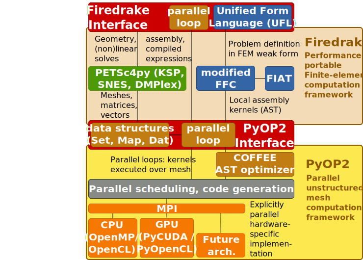

class: center, middle, inverse

# Productive and Efficient Computational Science Through Domain-specific Abstractions

## **Florian Rathgeber**1
## Supervisors: David Ham1,2, Paul Kelly1

.footnote[1 Department of Computing, Imperial College London
2 Department of Mathematics, Imperial College London]

---

## Scientific Software

### Ideal world
* computationally efficient
* maintainable
* composable
* allow scientists to work very productively

--

### Reality
* solve a very specific research problem
* for a specific kind of user
* on a particular hardware platform

--

### Solution?

Get the abstractions right!

---

.scale[]

> Firedrake is an automated system for the portable solution of partial
> differential equations using the finite element method (FEM).
>
> .source[&mdash; firedrakeproject.org]

--

Two-layer abstraction for finite element computation from high-level descriptions:
* Firedrake: a portable finite element computation framework  
  *Drive FE computations from a high-level problem specification*
* PyOP2: a high-level interface to unstructured mesh based methods  
  *Efficiently execute kernels over an unstructured grid in parallel*

---

background-image:url(images/fem.svg)

---

## The Firedrake/PyOP2 tool chain

---

## Two-layered abstraction: Separation of concerns

