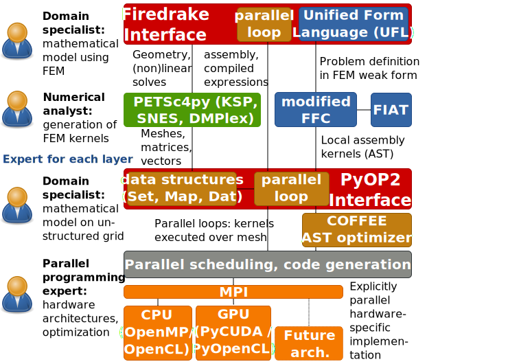

class: center, middle, inverse

# Productive and Efficient Computational Science Through Domain-specific Abstractions

## **Florian Rathgeber**1
## Supervisors: David Ham1,2, Paul Kelly1

.footnote[1 Department of Computing, Imperial College London
2 Department of Mathematics, Imperial College London]

---

.left-column[
## Computational Science landscape

* Rapidly changing
* Many-core hardware: paradigm shift
* scientific software needs to keep up
]

--

.right-column[
## Scientific Software

### In an ideal world
* computationally efficient
* maintainable
* composable
* allow scientists to work very productively
]

--

.right-column[
### Reality
* solve a very specific research problem
* for a specific kind of user
* on a particular hardware platform
* hard to port to different platform
]

--

.right-column[
### Solution?

* Separating the low-level implementation from the high-level problem specification
* Generate platform-specific implementations from a common source instead of hand-coding them
* Runtime code generation and JIT compilation open space for compiler-driven optimizations and performance portability
]

---

background-image:url(images/fem.svg)

---

.scale[]

> Firedrake is an automated system for the portable solution of partial
> differential equations using the finite element method (FEM).
>
> .source[&mdash; firedrakeproject.org]

--

Two-layer abstraction for finite element computation from high-level descriptions:
* Firedrake: a portable finite element computation framework  
  *Drive FE computations from a high-level problem specification*
* PyOP2: a high-level interface to unstructured mesh based methods  
  *Efficiently execute kernels over an unstructured grid in parallel*

---

## The Firedrake/PyOP2 tool chain

---

## Two-layered abstraction: Separation of concerns

---

## Thank you!

Contact: Florian Rathgeber, [@frathgeber](https://twitter.com/frathgeber), <f.rathgeber@imperial.ac.uk>

### Resources

  * **PyOP2** https://github.com/OP2/PyOP2
    * *[PyOP2: A High-Level Framework for Performance-Portable Simulations on Unstructured Meshes](http://dx.doi.org/10.1109/SC.Companion.2012.134)*
      Florian Rathgeber, Graham R. Markall, Lawrence Mitchell, Nicholas Loriant, David A. Ham, Carlo Bertolli, Paul H.J. Kelly,
      WOLFHPC 2012
    * *[Performance-Portable Finite Element Assembly Using PyOP2 and FEniCS](http://link.springer.com/chapter/10.1007/978-3-642-38750-0_21)*
       Graham R. Markall, Florian Rathgeber, Lawrence Mitchell, Nicolas Loriant, Carlo Bertolli, David A. Ham, Paul H. J. Kelly ,
       ISC 2013
  * **Firedrake** https://github.com/firedrakeproject/firedrake
    * *COFFEE: an Optimizing Compiler for Finite Element Local Assembly*
      Fabio Luporini, Ana Lucia Varbanescu, Florian Rathgeber, Gheorghe-Teodor Bercea, J. Ramanujam, David A. Ham, Paul H. J. Kelly,
      submitted
  * **UFL** https://bitbucket.org/mapdes/ufl
  * **FFC** https://bitbucket.org/mapdes/ffc

Slides created with [remark](http://remarkjs.com)
